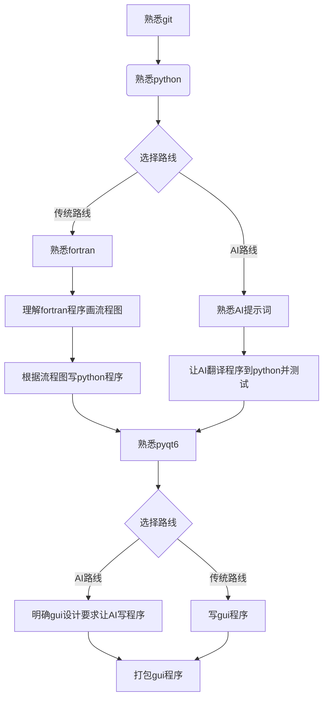

# Structure Generator

## 项目目标
在windows上形成一个具有图形界面的，结构输入文件生成器

## 技术路线
有两条技术路线，传统路线（人写程序），AI路线（人提要求，AI写程序，人调整）。

两种路线共同的地方是都要先学习一下git
1. 简单熟悉git，快速过一下git的介绍，网上有很多，例如[这个](https://www.w3schools.com/git/git_intro.asp?remote=github)：
    - 能够把这个仓库clone到本地
    - 能够创建一个新的分支，然后在新的分支上修改某个文件，并commit你的修改，然后push本地修改到服务器
    - 能够在github上创建一个pull request
    - 能够在github上review一个pull request
    - 能够merge一个pull request
    - 能够在本地删除一个分支
2. 简单熟悉python，网上随便找个教程了解一下语法，例如[这个](https://www.w3schools.com/python/default.asp)：
    - 矩阵及numpy库
    - 循环
    - if else语法
    - 文件输出
3. 简单熟悉pyqt6，你需要学习一下pyqt6的[基本用法](https://www.tutorialspoint.com/pyqt/index.htm)，有兴趣可以也可以看比较[完整的教程](https://www.pythonguis.com/pyqt6/)，我们的应用需求非常简单，只需要了解：
    - layout
    - widget
    - signal

### 传统路线
传统路线中，你需要自己看懂fortran程序，然后翻译成python。
1. 简单熟悉fortran，快速过一下fortran的[语法](https://www.tutorialspoint.com/fortran/index.htm)，至少要了解一下这几个点：
    - 基本的程序结构
    - 变量声明及常见变量类型
    - 矩阵及allocate给矩阵分配内存
    - fortran自带的随机数生成
    - 循环
    - if else语法
    - 文件输出
2. 翻译
    - 看懂fortran程序
    - 画fortran程序的流程图
    - 根据流程图写python的程序
3. 制作gui

### AI路线
AI路线中，你不再需要了解fortran，可以让AI帮助你翻译程序，你再负责测试。在了解pyqt6的用法后，你可以让AI帮你写gui程序，然后你负责测试。AI可以使用chatgpt（需要翻墙）、claude2、文言一心。推荐使用chatgpt或者claude2因为他们能处理的信息长度比较长，而文言一心有2000字符的限制。